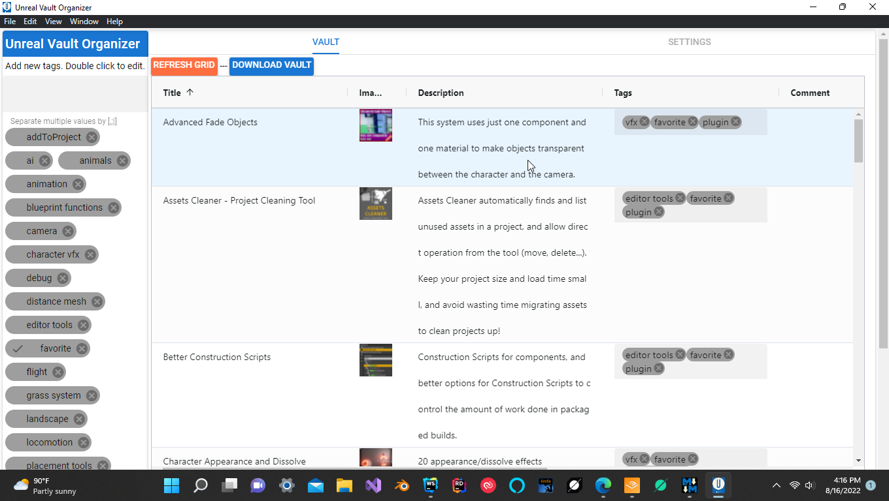
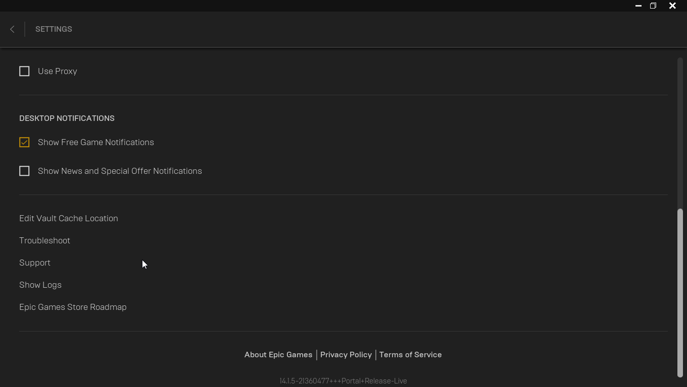
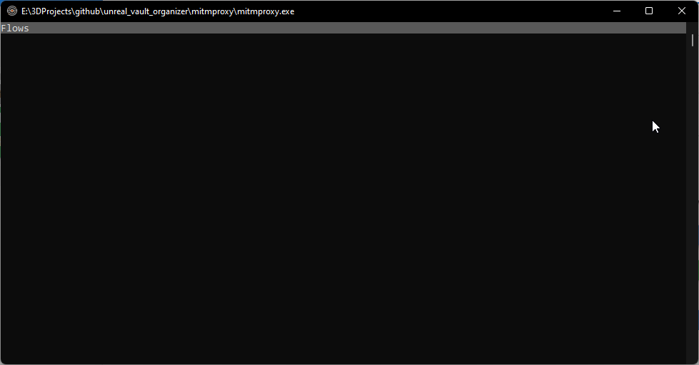

# Unreal Vault Organizer using Electron 

Organize your unreal vault assets

A simple application that downloads your unreal vault inventory and allows you to organize it by tags.  In addition it will notify you when you have updates for a plugin.  You can then sort by updates to determine which plugins have updates available(still testing this).



Intro video: https://youtu.be/ywnvcVgiW3o (Older video -- there is a new process for getting the Unreal Auth token as described below.  The video is still relevant for application features.  You no longer need to install Fiddler.)


Download the latest version from the release pages https://github.com/delebash/unreal_vault_organizer/releases

 The exe will run the normal windows application installer. The exe has a built in update ability and will notify you and update when a new release is out.  The zip or portable version does not have this ability.

Click on Unreal Vault Organizer. You will be asked for admin permission as this is necessary to obtain the Unreal authorization token using the built in network sniffer.

# Support:
Add issues in github

Get help at my discord channel https://discord.gg/2WkHWNDf8q

Other free Unreal projects:

https://github.com/delebash/UnrealMapboxBridgePlugin

https://github.com/delebash/unreal_mapbox_bridge


# Setup Instructions:

Install SSL certificates (one time install).

1) Select Settings Tab
2) Copy your Unreal Vault Path and paste into the Unreal Vault Path Field

    You can find this path in your Unreal Launcher Settings  
    
3) Before you can get an Unreal Authorization Token you need to install SSL certificates so the built in sniffer can decypt SSL traffic and read the token.

4) Click on Install Sniffer SSL Certificates.  Two windows will open and then close quickly.  Then your certificates should be installed.



Get Unreal Authorization Token (You need one before you can download your vault assets).

1) Click Get Token

2) Wait for a screen to open and show the word Flows.



3) If your Unreal Launcher is already running, click on it to get it to re-request a token.  The Flows window will close once a token is found.  If the window does not close in a few seconds, exit your Unreal Launcher and re-open it.  The token should now be detected and the Flows window will close.


Download your Vault

1) Go to the Vault Tab

2) Click the Download Vault button.  If you get a warning "Please request a token" then you token has timed out and you need to go to the Setting page and get a new one.

Application Screen shots:

When you get a notification that you have Updates.  Click on the Updates Available column to sort it or add a filter of 1 for true 0 for false.  Remember to clear the filter to reset the grid.

Click on the Image of the product you have an Update for and it will open in the Launcher so you can update it.


.png)

.png)

.png)

.png)

.png)

.png)


# Developer:
## Install the dependencies
```bash
npm install
```

### Start the app in development mode (hot-code reloading, error reporting, etc.)
```bash
npm start
# or
npm run debug
```


## Project Thanks:

*Many thanks to the <a href="https://github.com/mitmproxy/mitmproxy" target="_blank">MIMT</a> Proxy project for it's awesome sniffer.  This sniffer enables us to get the Unreal Auth Token!*
